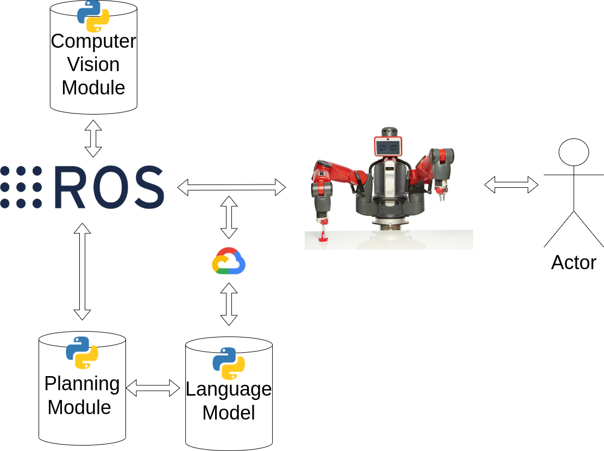

# kth-rpl-hackathon-2022
Repository hosting the code for the 2022 Robotics, Perception and Learning hackathon

The theme for this year's hackathon was inspired by a Japanese technique of wrapping objects with a cloth (furoshiki) and it was performed by Baxter!
### Furoshiki - Japanese Gift Wrapping

<div align="center">
  <a href="https://www.youtube.com/embed/c5wC4ITYvBY"></a>
</div>

---

To attempt this task we organized our approach as follows:



We decided to reformulate the task as both a human-robot interaction task and a conversational robot. An actor cooperates directly with Baxter to achieve the final goal of the task. Notice that all folding parts are made by the robot. An example of a full interaction from start to finish goes as follows:
1. Baxter asks the human to propose a corner for folding.
2. The human picks one of the corners and makes it visible to a camera.
3. Baxter asks if he can grasp the corner and proceeds to fold. 
4. The process is repeated until the box is completed wrapped.
5. The human ties the loose folded corner ends to complete the furoshiki gift wrap.

There are three distinct modules <b>computer vision</b>, <b>state_machine</b>, <b>language</b>:
- <b>computer vision</b>: Responsible for publishing to <b>ROS</b> the topics related to the orientation of the box, and the corners of the cloth, for more information please check the `computer_vision` folder.
- <b>state_machine</b>: Responsible for the macro level planning, it is represented by a state machine created in <b>ROS</b>, connects both the <b>control</b> part of Baxter by reading the topics published from the computer vision module and the language module. More information on how to install the Baxter-related packages is given under the `state_machine` folder. 
- <b>language</b>: The language module works outside of <b>ROS</b> for convinience of connection, and connects to a google API which converts speech-to-text which is used within the state machine. This module resides under the `state_machine` folder.


----
## To run the hackathon project

### Requirements

1. Follow the instructions under the `state_machine` folder to setup <b>ROS</b> and to setup a virtual environment for Baxter.

2. Setup all of Baxter sensors by running the explained commands under `steps` on the `state_machine` folder.

3. Follow the instructions under the `computer vision` folder to install the necessary packages and to publish the .

### Run the state machine

1. After following the requirements section closely, make sure the ropics are read by using 
```
rostopic list
```

2. Alter the `mic_config.json` under <b>state_machine</b> by changing the `Audio_IP` and `audio_port`
```
"Audio_IP": "<ip of your microphone>",
"audio_port": "<port of your microphone>",
```

A suggestion for a mic, could be your own phone! You can install [IP Webcam](https://play.google.com/store/apps/details?id=com.pas.webcam&hl=en&gl=US) from the [Google Play](https://play.google.com/)
Then identifiy the IP of the webcam and replace it on the `Audio_IP` value.

Alternatively, use the provided microphone server on your computer: ```python state_machine/src/scripts/mic_server.py``` and chaging the "Audio_IP" and the "audio_port" accordingly

3. Finally run the state machine folding task by running:
```
python state_machine/src/language_folding.py
```
The interaction is made by voice, so answer the robot!

If you are the next hackathon team, may the <b>ROS</b> force be with you!
